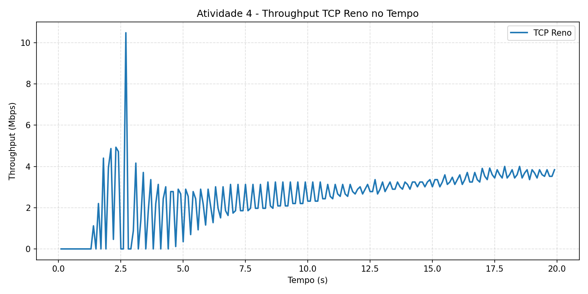
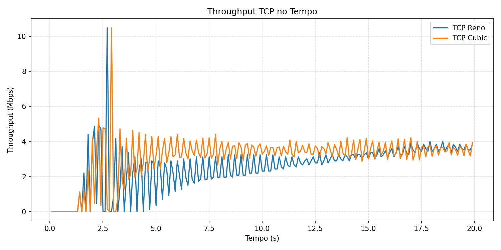
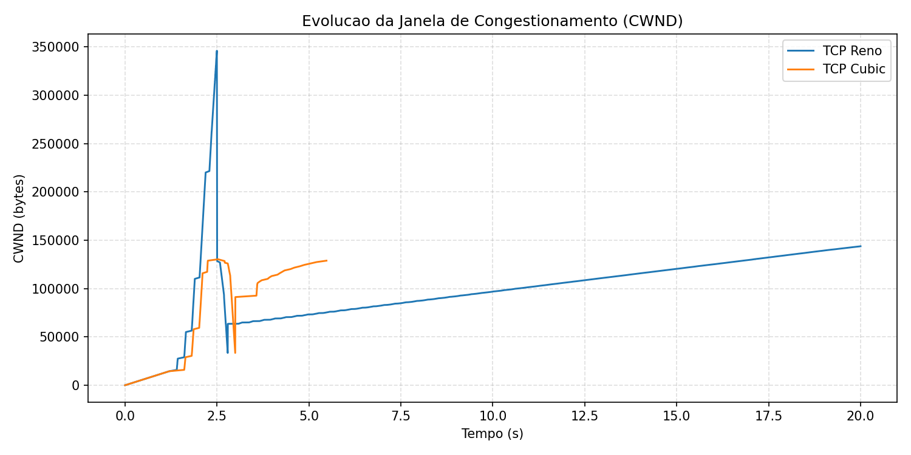

# Exercício 1 - Resumo (Itens 2 a 6)

Implementação em [activity2-dumbbell.cc](activity2-dumbbell.cc). Resultados em [results](results).

Para gerar os gráficos a partir dos arquivos `.dat`, usar [plot_activity2.py](plot_activity2.py).

## 2) Topologia

Atividade 2 considera apenas a topologia dumbbell da figura:

- enlaces de acesso: 10 Mbps, 40 ms;
- enlace entre roteadores: 10 Mbps, 20 ms.
- lados esquerdo e direito com 2 hosts cada (S1, S2 e D1, D2);
- roteamento IPv4 global habilitado para permitir comunicação fim a fim.

## 3) Tráfego de fundo UDP

Foi configurado um fluxo UDP de fundo com:

- taxa: 8 Mbps;
- duração: toda a simulação.
- origem no lado esquerdo e destino no lado direito;
- objetivo: ocupar parte fixa da banda do gargalo para criar concorrência com o TCP.

## 4) S1 com TCP Reno (5 Mbps) concorrendo com UDP

Foi configurado fluxo TCP em S1 com taxa oferecida de 5 Mbps, concorrendo com o UDP.

Configuração de medição:

- tempo total de simulação: 20 s;
- início dos fluxos: 1 s;
- amostragem de throughput: 0,1 s;
- medição de janela via trace de `CongestionWindow` no socket do transmissor S1.

Saídas:

- throughput no tempo: [results/activity2-reno-throughput.dat](results/activity2-reno-throughput.dat)
- evolução da janela (CWND): [results/activity2-reno-cwnd.dat](results/activity2-reno-cwnd.dat)

Gráfico da Atividade 4 (Reno):

Resumo numérico:

- bytes TCP recebidos: 6.408.000
- throughput médio TCP: 2,70 Mbps
- série temporal de throughput indica estabilização próxima da banda residual após fase transitória inicial.

## 5) Mesmo estudo com TCP Cubic

Mesmo cenário, trocando a variante TCP para Cubic.

Todos os demais parâmetros foram mantidos iguais ao item 4, mudando apenas o algoritmo de controle de congestionamento.

Saídas:

- throughput no tempo: [results/activity2-cubic-throughput.dat](results/activity2-cubic-throughput.dat)
- evolução da janela (CWND): [results/activity2-cubic-cwnd.dat](results/activity2-cubic-cwnd.dat)

Resumo numérico:

- bytes TCP recebidos: 7.764.000
- throughput médio TCP: 3,27 Mbps
- curva de throughput mostra recuperação mais rápida após variações de fila/contensão.

## 6) Diferenças observadas

- Cubic obteve maior throughput médio que Reno neste cenário (aprox. 21% a mais).
- Reno apresentou oscilação mais forte de janela ao longo do tempo.
- Com UDP fixo em 8 Mbps no gargalo de 10 Mbps, ambos disputam a banda residual, e o Cubic aproveitou melhor essa banda.
- Em termos práticos, o Cubic foi mais eficiente para manter boa-vazão do fluxo TCP sob concorrência constante de UDP.

## Gráficos

### Throughput TCP no tempo

### Evolução da janela de congestionamento (CWND)

